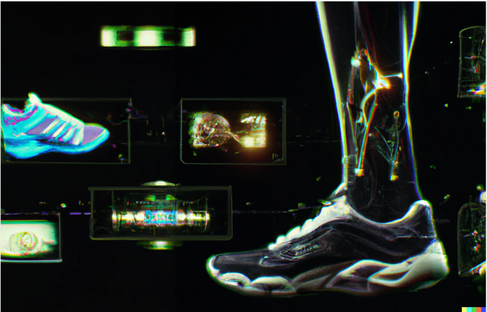

# Deep Learning's Achilles Heel
## Exploring Bias, Instability, and Robustness Challenges

> The content serves as a companion to our discussion in the lectures titled "Deep Learning's Achilles Heel: Exploring Bias, Instability, and Robustness Challenges" in [DAT255](https://hvl.instructure.com/courses/21919/). 

## Jupyter Notebooks

| Notebook    |      1-Click Notebook      |
|:----------|------|
| [dat255-1-0-adversarial-dogs-vs-cats.ipynb](https://nbviewer.org/github/HVL-ML/DAT255/blob/main/4-challenges/dat255-1-0-adversarial-dogs-vs-cats.ipynb)   | |
| [dat255-2-0-fgsm-attack-musculoskeletal-x-ray.ipynb](https://nbviewer.org/github/HVL-ML/DAT255/blob/main/4-challenges/dat255-2-0-fgsm-attack-musculoskeletal-x-ray.ipynb)   | |
